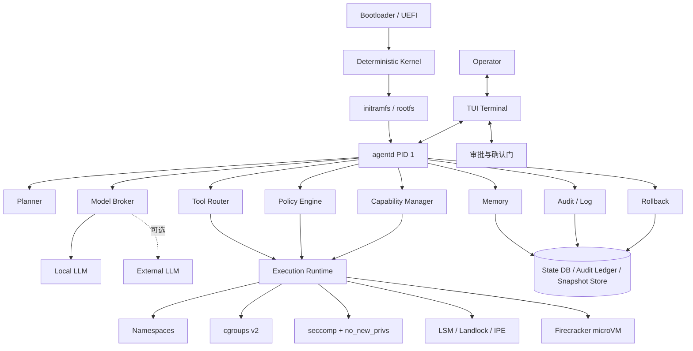
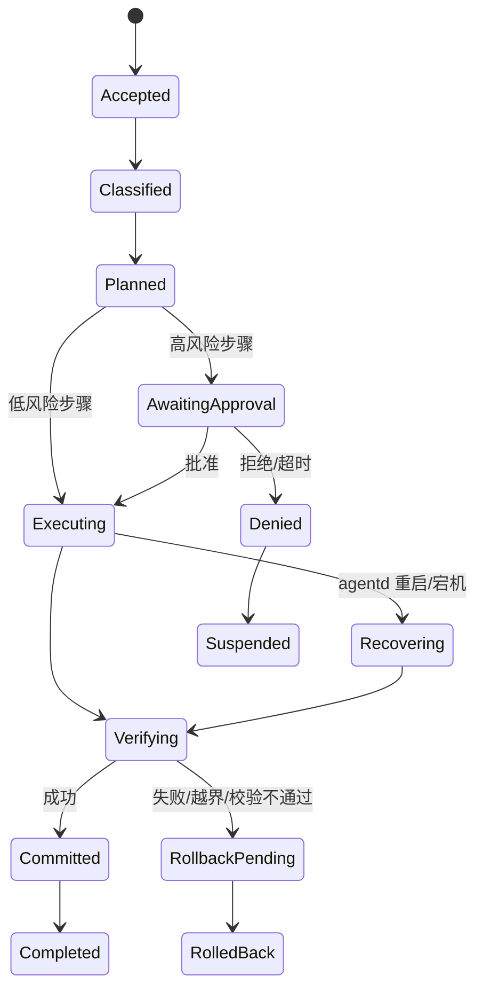
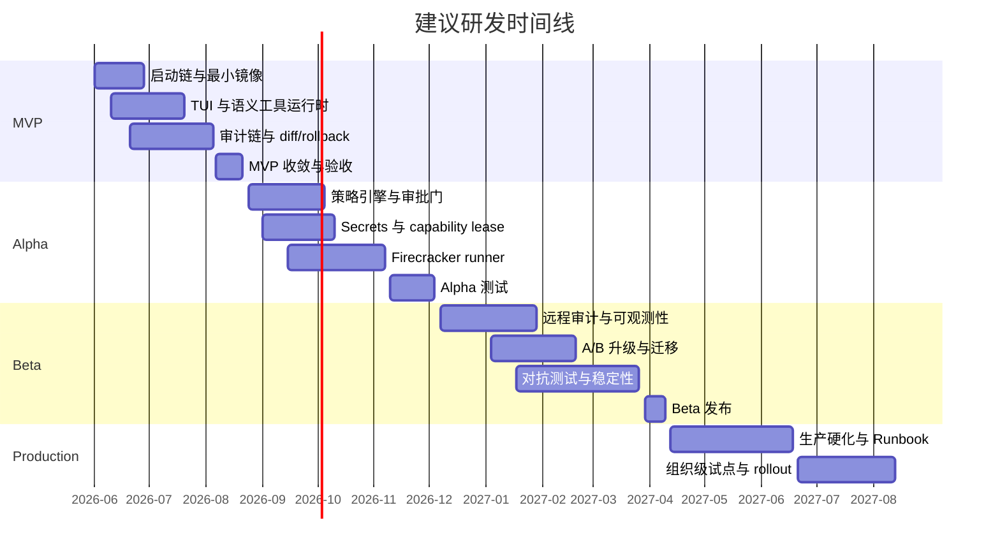
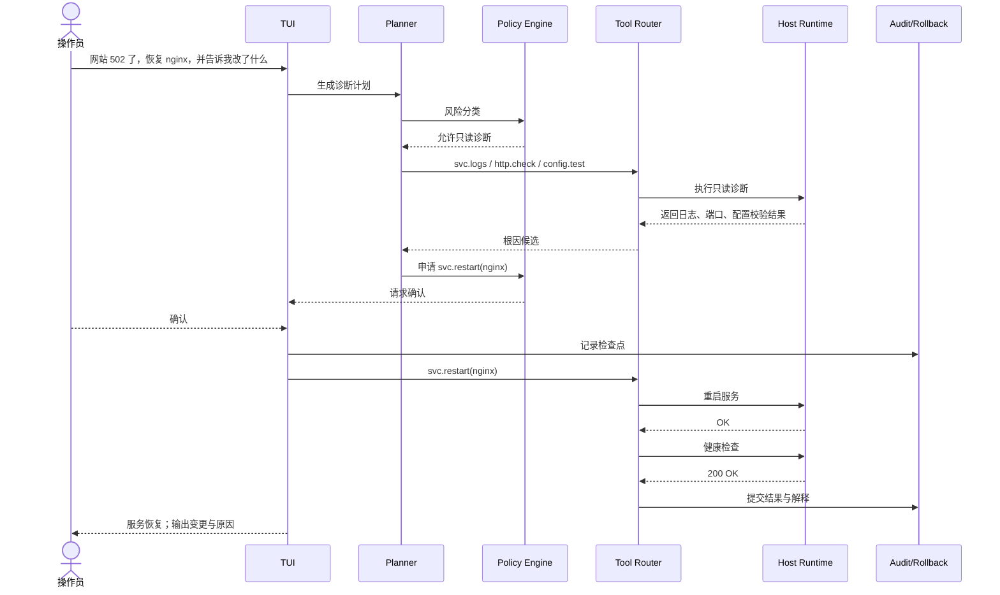
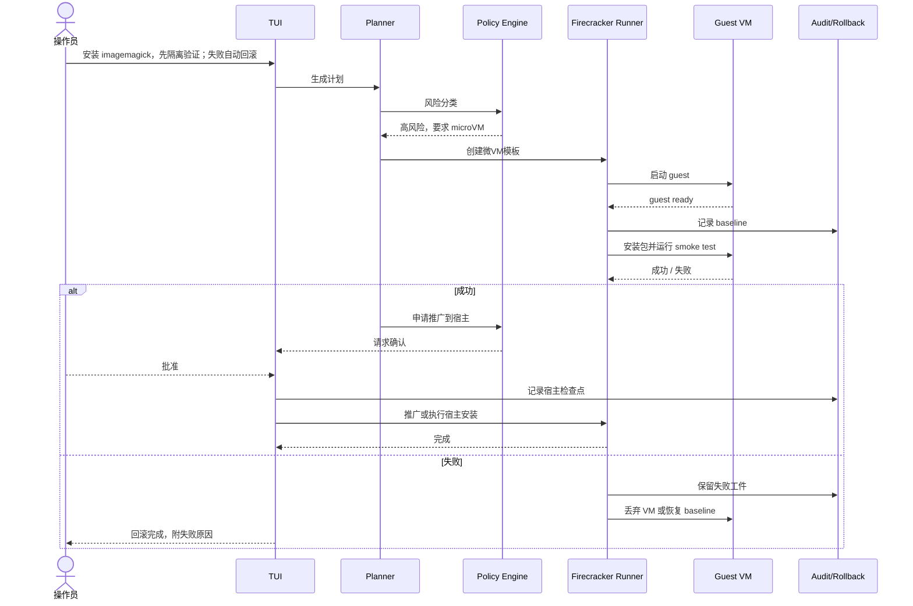
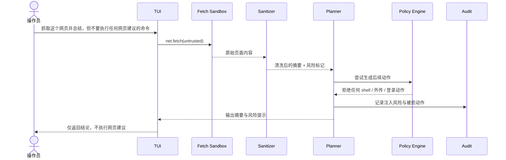

# Agent Based OS 设计分析报告

## 执行摘要

本报告建议将项目定义为一种**Agent-first 的操作系统环境**：Linux 或其他确定性内核负责内存、进程、设备、隔离与权限边界；`agentd` 作为 PID 1 负责意图理解、计划生成、风险分类、工具编排、审计与恢复；terminal 则是唯一原生交互界面。这个边界与 Linux 既有“早期用户态/`init`”机制一致，也比把大模型直接塞进内核更可控。citeturn20view0turn20view3turn30view0turn8view15

近期最可行的产品路线不是“新写一个内核”，而是**Linux LTS 基座 + `agentd` 引导链 + cgroup v2 / namespaces / seccomp / LSM / Landlock + 可选 Firecracker microVM**。Linux 已经提供了成熟的控制组、命名空间、系统调用过滤、附加访问控制与 KVM 能力；Firecracker 又在此之上提供了轻量 microVM、极小设备模型、内建速率限制与第二道用户态隔离。citeturn8view2turn28view2turn18view0turn8view4turn8view5turn9search0turn12search7turn12search5

内核选型上，**Linux**适合 MVP、开发者 VM、server 与 cloud VM；**Linux+Firecracker**适合第三方包安装、任意代码执行、处理不可信网页与高风险运维；**seL4/Genode**适合作为高安全版长期分支，因为 seL4 具备形式化验证与强 capability 模型，Genode 则提供组件化、安全导向的系统构造框架；**Redox**与**Zircon**更适合作为研究与架构参考，而不是第一代产品基座。citeturn10view0turn10view1turn10view3turn21search0turn21search2turn11search17turn11search10turn8view10turn10view6turn10view7

`agentd` 不应直接拿到“无限 shell 权限”。正确做法是把所有副作用都编译成**高层 capability lease**，再映射到 Linux 用户/组、mount/user/pid/net namespace、cgroup、seccomp、LSM、Firecracker 等具体机制；同时把**决策**与**执行**分离，让高风险动作必须经过精确绑定的审批记录。OWASP 与 OpenAI 的最新 agent 安全文档都强调：高影响动作需要 human-in-the-loop；对外部内容的操纵风险不能只靠输入过滤，而要靠系统边界把危害约束住。citeturn25view2turn25view3turn18view4turn29view0turn29view1

安全策略必须假设**prompt injection 仍会长期存在**。因此，系统需要把网页、邮件、文档、API 响应全部视为不可信输入；把读取与执行解耦；对 secrets 使用句柄而非明文；对工具使用最小权限；对日志、审批、回滚点建立可追溯链；对构建与升级引入 provenance、签名与供应链风险控制。citeturn25view4turn29view2turn18view2turn26view0turn26view1turn26view2

如果以 **2026-06-01** 作为项目启动假设，本文建议的现实排期是：**10–12 周完成 Linux MVP**，**再用 12–16 周做 Alpha（加入 Firecracker 与更完整的策略引擎）**，**再用 16–20 周进入 Beta 与大规模对抗测试**；高安全版若切到 seL4/Genode，应视作独立产品线，不应拖慢 Linux 主线。以下所有工期均为本文估算，不是官方承诺。  

## 范围、假设与定位

与近期“AIOS / Agent Operating System”相关研究相比，本文采取的是更保守也更工程化的边界：**把 LLM/agent 放在 OS 的控制平面，而不是把它放进内核本体**。AIOS 论文强调的是为 agent 提供调度、上下文管理、内存管理、存储与访问控制等“操作系统式”服务；而 Linux 的事实则是，PID 1 本来就是用户态 init，早期用户态可由 `initramfs`/`initrd` 与 `init=`、`rdinit=` 参数接管。因此，`agentd` 作为 PID 1 是工程上自然的，而“AI kernel”则会把不可预测性推入最不该失真的层。citeturn8view15turn20view0turn20view3turn30view0turn30view1

下表列出本文明确采用的“未指定/假设”前提。它们不是系统必须条件，但会直接影响实现复杂度、性能预算与安全边界。

| 项目 | 未指定/假设 |
|---|---|
| 目标硬件 | **未指定/假设：**MVP 以 `x86_64` 为主，要求支持硬件虚拟化；后续再扩展到 ARM64。 |
| 网络策略 | **未指定/假设：**宿主机可联网；不可信任务默认无外网或仅允许白名单出口。 |
| 外部 LLM | **未指定/假设：**允许外部 LLM 作为可选增强；系统必须支持纯本地模型降级运行。 |
| 租户模型 | **未指定/假设：**MVP 为单租户/单操作员；多租户隔离留到 Alpha 之后。 |
| GUI 范围 | **未指定/假设：**不提供本地 GUI 作为原生交互；任何图形界面都只是 terminal 状态的投影。 |
| 包管理 | **未指定/假设：**底层发行版包管理器可插拔，先做 Debian/Ubuntu 适配最现实。 |
| 可靠性等级 | **未指定/假设：**先满足开发与生产运维可恢复性，再考虑高保证认证路线。 |

从产品定位看，最重要的不是“先覆盖所有场景”，而是找到**最容易展示终端价值、同时最容易建立安全边界**的切入点。建议优先级如下。

| 产品形态 | 核心价值 | 典型用户 | 主要约束 | 建议优先级 |
|---|---|---|---|---|
| 开发者 VM | 仓库理解、依赖修复、日志解释、服务恢复、环境自举 | 开发者、平台工程师 | 单机状态复杂，但控制域单一 | **最高** |
| Cloud VM | 远程运维、故障诊断、自愈、审计、快照 | 平台/SRE/基础设施团队 | 要求更完整审批和回滚 | **很高** |
| Server | 服务管理、补丁、配置变更、应急响应 | 运维、安全、后台团队 | 风险更高，审批更严格 | **高** |
| Container | 作为 CI runner / 作业环境 / sidecar 控制面 | 平台、构建系统 | 不掌控底层内核，PID 1 语义受限 | **中** |
| 高安全版 | capability-first、高保证隔离、静态部署 | 国防、嵌入式、关键基础设施 | 驱动与生态成本显著上升 | **后置** |

结论上，**第一代产品最适合做“开发者 VM / Cloud VM”二选一或双轨并进**。前者最容易验证“terminal 即 OS”的交互优势，后者最容易验证“agentd 作为控制平面”的运维优势；二者都能自然复用 Linux 的早期用户态、命名空间、cgroup、KVM 与审计设施。Firecracker 对 64 位 Intel、AMD 与 Arm 且具备虚拟化扩展的平台可用，这使 cloud VM 路线尤其合理。citeturn8view6turn9search0turn8view5

## 总体架构与内核选型

本文建议的总体原则可以概括为一句话：**Kernel handles reality; `agentd` handles intention.** 也就是说，内核仍然只承担确定性职责；agentd 则成为用户态第一控制平面，负责将“意图”翻译成受控副作用。Linux 已经允许通过 `init=` 指定 `/sbin/init` 之外的启动二进制，也允许通过 `rdinit=` 在早期用户态从 ramdisk 直接启动指定程序；未识别的命令行参数还可传给 init，这非常适合把 `agentd` 做成可配置的 PID 1。citeturn30view0turn30view1

**组件关系图**



这个架构的关键，不是把 agentd 做成“万能 shell”，而是把它做成**可审计的 capability compiler**。Linux 的 cgroup v2 文档明确给出了统一层级下的资源控制接口；seccomp 文档明确说明它是“缩小暴露的内核表面”的工具，而不是完整沙箱；Landlock 则允许非特权进程为自己再加一层只增不减的约束；LSM 提供附加访问控制钩子；KVM 提供虚拟化基础；Firecracker 在此之上实现了更小、更快、更少设备的 microVM。citeturn8view2turn28view2turn8view4turn18view0turn8view5turn9search0

下表给出五条候选内核/基座路线的比较。表中“实现难度”“适用场景”“安全边界判断”是本文综合判断；涉及架构事实、平台支持与安全机制的部分均基于官方或原始资料。citeturn20view0turn20view3turn8view2turn28view2turn8view4turn8view5turn9search0turn12search7turn10view0turn10view1turn10view3turn21search2turn11search17turn11search10turn8view10turn10view6turn10view7

| 方案 | 优点 | 缺点 | 适用场景 | 实现难度 | 生态与驱动支持 | 安全边界 |
|---|---|---|---|---|---|---|
| Linux | 最快落地；可以直接利用 `initramfs`、`init=`、namespaces、cgroup v2、seccomp、LSM、KVM；便于兼容现有发行版与运维流程 | 内核与发行版复杂；若不给 agent 足够约束，误操作半径会很大 | 开发者 VM、server、container、cloud VM 的 MVP 与主线 | **低到中** | **最高**；现有工具链、驱动、包管理与可观测性最成熟 | 通过 namespace/cgroup/seccomp/LSM 建立用户态边界，但对内核复杂度本身不做“高保证”承诺 |
| Linux + Firecracker | 在 Linux 上获得更强工作负载隔离；microVM 启动快、内存开销小、设备模型小；`jailer` 增加 cgroup/namespace/降权第二防线 | 需要硬件虚拟化；网络、磁盘、快照、宿主编排更复杂；并非所有操作都值得进 VM | 第三方包安装、任意代码、网页自动化、不可信文档处理、高风险运维 | **中** | 依赖 Linux/KVM，宿主生态强；guest 需维护镜像模板 | 边界显著强于纯进程沙箱，适合把“危险动作”外包到 microVM |
| seL4 / Genode | seL4 capability 模型清晰，且形式化验证覆盖到二进制级别；Genode 强调组件化与最小暴露面，也可叠加多种 base platform | 驱动、团队经验、可移植工具链与通用运维成本高；不适合第一代大而全产品 | 高安全版、嵌入式、国防、关键基础设施、静态系统图谱 | **高到很高** | **中到低**；需要更有针对性的硬件与组件策略 | 边界最强，尤其适合“先定图、后运行”的高保证系统 |
| Redox | Rust 微内核、用户态驱动与 scheme 模型很适合研究“agent-native OS” | 兼容性、硬件支持、生产运维生态远不如 Linux | 长期研究分支、概念验证、语言与微内核实验 | **高** | **低到中**；项目在进步，但不适合首发产品 | 理论边界干净，但现实交付能力与运维成熟度不足 |
| Zircon | handle-rights、job/process/thread、组件 capability routing 的体系很现代；对“capability-first”设计很有启发 | 生态与分发模式不是围绕你的产品目标构建；硬件与组件模型切换成本大 | 设计参考、思想借鉴、长期研究 | **高** | **中**；有官方体系，但不适合快速替换 Linux | 安全模型清晰，但迁移成本与生态摩擦较大 |

对应的**决策建议**很明确：**主线选 Linux，执行隔离选 Firecracker，seL4/Genode 只在高安全版开并行分支；Redox 与 Zircon 保持研究级关注即可。** 这与 seL4 的“root task capability 启动模型”、Genode 的“组件在独立保护域中交互”、Redox 的“用户态驱动与 scheme”、以及 Zircon 的“权利由 handle 持有、组件通过 capability routing 暴露能力”的方向并不冲突，反而可以为后续重构能力层提供设计参考。citeturn10view0turn10view3turn11search5turn10view6turn10view7

## agentd 详细设计

在启动链上，`agentd` 有两种合理落点：其一是运行在 `initramfs` 里，先拉起最小 TUI、策略引擎、状态目录、模型代理与恢复逻辑，再切换到真实根；其二是作为最终 rootfs 中的 `/sbin/agentd`，由 `init=` 直接启动。Linux 的早期用户态与 `initrd` 文档都表明，在切根前完成最小用户态准备是标准能力；systemd 作为 PID 1 的文档则可视作功能对照组。citeturn20view1turn20view3turn20view0turn30view0

**任务生命周期状态图**



为了让 PID 1 可恢复、可测试、可审计，建议将 `agentd` 的内部 API 固化为少量确定性边界：

```text
Plan(IntentCtx) -> PlanSpec
Classify(PlanSpec) -> RiskClass
Evaluate(PlanStep, Context) -> PolicyDecision
Acquire(PolicyDecision) -> CapabilityLease
Invoke(CapabilityLease, SemanticToolCall) -> Effect
Verify(Effect) -> VerificationResult
Commit(RunId, Effect, Artifacts) -> CommitId
Rollback(CommitId or RunId) -> RollbackResult
Recover(BootContext) -> ReconciledState
```

与 OpenAI 的最新 Agents SDK 设计一致，真正可控的系统应由**宿主应用拥有 orchestration、tool execution、state 与 approvals**；AI 本身只负责计划与推理，不直接决定最终副作用。citeturn18view5turn18view4

下表给出 `agentd` 核心模块的设计建议。接口、状态机、持久化与预算值多为本文设计目标；其中“高风险动作暂停审批”“工具旁路校验”“agent 需保留足够状态完成多步任务”等设计方向，与 OWASP 与 OpenAI 的 agent 文档一致。citeturn25view2turn25view3turn18view4turn18view5

| 模块 | 核心接口 | 数据流 | 状态机 | 持久化与恢复 | 性能与延迟预算 |
|---|---|---|---|---|---|
| Planner | `Plan(IntentCtx)->PlanSpec` | 输入用户意图、当前系统态、会话记忆；输出步骤 DAG、目标、约束、成功条件 | `Idle -> Drafting -> Reviewable -> Frozen` | 只持久化最终 `PlanSpec`、版本化提示模板、模型摘要；崩溃后从最近冻结计划继续 | 本地小模型分类 `50–200ms`；复杂规划 `0.8–3s` 为宜 |
| Memory | `Get/Put/Search/Evict` | 区分会话记忆、运行记忆、操作记忆、语义记忆、隔离记忆 | `Hot -> Warm -> Cold -> Expired/Quarantined` | 会话层进 `tmpfs`；结构化元数据进 `SQLite/WAL`；长期语义条目带 TTL、完整性哈希与来源标记 | 元数据查找 `<10ms`；本地召回 `10–80ms` |
| Tool Router | `Route(SemanticToolCall)->Executor` | 只接受语义化工具调用，不默认暴露任意 shell | `Pending -> Dispatching -> Streaming -> Done/Retry` | 记录工具名、参数规范化结果、执行器版本；恢复时重建未完成调用 | 路由本身 `<5ms`；不含外部执行耗时 |
| Policy Engine | `Evaluate(step, ctx)->Decision` | 读取 plan、risk、capability、审批记录、策略版本 | `Loaded -> Evaluating -> Allow/Deny/Pause` | 策略文件版本化；所有决策写入审计链；重启后以决策日志重建 | 规则命中 `<5ms`；复杂 ABAC/策略合并 `<50ms` |
| Capability Manager | `Acquire/Revoke/Renew` | 把高层 capability 编译为用户、namespace、seccomp、cgroup、microVM 参数 | `Requested -> Bound -> Leased -> Revoked/Expired` | 只持久化 lease 元数据与过期时间；重启后主动回收孤儿 lease | 发放/撤销 `<20ms`，不含沙箱创建 |
| Audit / Log | `Append/Seal/Query` | 写入意图、计划、审批、工具、结果、回滚、模型摘要 | `Buffering -> Committed -> Sealed` | 采用 append-only 事件流 + 索引库；关键事件批量 `fsync`；支持远端镜像 | 单条事件追加 `<5ms`；批量 seal `<20ms` |
| Rollback | `Prepare/Trigger/Verify` | 为写入动作生成 diff、快照、撤销脚本、事务边界 | `Prepared -> Checkpointed -> Triggered -> Verified -> Closed` | 回滚句柄与工件索引必须持久化；恢复时优先处理 `RollbackPending` 任务 | 元数据准备 `<20ms`；文件/镜像快照视范围而定 |
| TUI terminal | `Attach/Render/Prompt/Approve` | 用户输入、计划预览、审批、审计查询、恢复提示 | `Detached -> Attached -> Interactive -> Suspended -> Resumed` | 会话布局无需强持久化；审批与交互决定必须持久化 | 回显与本地渲染应近实时；首次“可操作反馈”< `300ms` |
| Model Broker / Local LLM | `Infer/Cancel/Fallback` | 为 planner、summarizer、classifier、sanitizer 提供统一模型路由 | `Ready -> Inferencing -> Fallback -> Error -> Ready` | 持久化模型 ID、digest、策略标签、延迟统计；恢复时不重放推理，只重放结果摘要 | 本地分类优先；远程模型超时后降级到只读/需人工继续 |

**持久化与恢复策略。** 建议把 `agentd` 做成“**事件先行、效果后置**”的 crash-only 系统：用户意图先写 `IntentReceived`；计划冻结后写 `PlanFrozen`；审批通过写 `ApprovalBound`; 工具调用前写 `EffectPrepared`; 执行成功后写 `EffectObserved`; 校验成功才写 `CommitSealed`。如果系统在执行中崩溃，重启后先扫描 `EffectPrepared` 与 `RollbackPending`，从而恢复“未完成但已触发副作用”的动作，而不是依赖模型重新推理一遍。这样的设计才能把模型不确定性锁在**决策前**，把恢复语义留给**事件日志**。  

**本地 LLM 接入策略。** 我建议把模型分为两档：一档是本地小模型，专做意图分类、风险识别、输入净化与 plan skeleton；另一档是本地大模型或外部 LLM，专做更重的解释与规划。对系统来说，任何模型都只能通过 `Model Broker` 被访问，不能由各模块直接发起网络请求。这样既能在“允许外部 LLM”的部署中保留可替换性，也能在“禁止外部 LLM”的环境中退化成纯本地模式。  

## 能力模型、安全与隔离

本文建议把 capability 设计成**高层语义租约**，而不是直接暴露 Linux syscall 或无限 shell。这样做的好处是：用户与策略引擎看到的是“允许读取哪类文件、允许在哪个范围内改配置、允许是否联网、允许是否访问 secret handle”，而不是成百上千条 syscall 与内核 flag。高层 capability 再由 `Capability Manager` 编译为 Linux 用户/组、挂载视图、命名空间、cgroup、seccomp、LSM 与 microVM 运行参数。这个思路与 seL4 的“不可伪造 capability 指向对象与资源”、Genode/Fuchsia 的 capability-based security 模式在精神上是一致的。citeturn10view0turn10view3turn10view6turn10view7

**权限等级设计**

| 等级 | 语义 | 典型对象 | 默认执行器 | 审批要求 | 审计要求 |
|---|---|---|---|---|---|
| `read-only` | 只读观察，不允许持久副作用 | 日志、配置快照、状态查询、网页抓取 | 本地 namespace 沙箱 | 无，默认允许 | 记录来源、范围、时长 |
| `write-with-diff` | 可修改，但必须生成差异、支持撤销 | 配置文件、项目源码、模板文件 | overlay/复制写沙箱 | 对系统关键路径需确认 | 记录 diff、base hash、回滚句柄 |
| `execute-with-confirmation` | 可以执行命令或工作流，但不持有长期高权限 | 服务重启、包安装验证、迁移脚本 smoke test | namespace 或 microVM | 明确确认 | 记录命令规范化结果、资源预算、退出码 |
| `privileged-with-human-approval` | 需要提升权限或影响外部系统/生产环境 | reboot、生产写入、secret 解封、网络外传 | 特权 helper 或 microVM 代理 | **必须人工批准** | 记录审批 token、参数哈希、到期时间 |
| `never` | 永不允许 | 原始块设备写入、内核模块注入、无限 shell、secret dump | 不执行 | 不适用 | 记录拒绝原因 |

OWASP 明确建议：agent 工具应最小权限、按工具和资源颗粒度进行权限裁剪；高影响或不可逆动作需要显式审批、预览、审计链与可中断回滚；同时，决策与执行应分离，审批记录要绑定到精确动作，而不是泛泛的“允许此会话做任何事”。OpenAI 的 guardrails 文档也强调，高风险副作用应该让工作流暂停，由人或策略决定是继续、终止还是拒绝。citeturn25view2turn25view3turn18view4

**高层 capability 到 Linux / Firecracker 的映射示例**

| 语义 capability | Linux 权限与命名空间映射 | seccomp / `no_new_privs` | cgroups / 资源边界 | Firecracker 使用方式 | 说明 |
|---|---|---|---|---|---|
| `fs.read:/var/log/nginx/*` | 独立 `mount namespace`，只绑定该目录为只读；可配 `user namespace` 降权 | 启用 `no_new_privs`；仅允许读相关 syscall | 限 CPU/内存，防止日志炸弹 | 通常不需要 | 适用于诊断与审计 |
| `fs.write.diff:/etc/nginx/nginx.conf` | 不直接改宿主原文件；先挂 overlay 或副本工作区 | 禁止危险 syscall；保留最小写集 | 限 IO 与内存；防止写爆 | 高风险时可改为 microVM 内验证 | “写”先在 shadow copy 发生，提交前必须 diff+校验 |
| `proc.exec:svc.restart(nginx)` | 不给通用 shell；只给语义化服务控制 helper | `no_new_privs` + 精细白名单过滤 | `cpu.max`、`memory.max`、`pids.max` 限制执行器 | 生产关键服务可转 microVM 验证后再落地 | 避免“任意 shell”成为默认工具 |
| `pkg.install:imagemagick` | 宿主仅持有只读仓库配置与最小 helper 权限 | 执行器层拒绝不必要 syscall | 限网络、磁盘、CPU，防 fork bomb 与资源耗尽 | **优先 microVM**；安装、测试、丢弃或推广 | 第三方包安装默认高风险 |
| `net.fetch:untrusted-web` | 独立 `net namespace` 或代理出口；默认无内网可见性 | 仅允许网络读，不允许本地副作用链 | 带宽/并发/时长限制 | 可在 microVM 中抓取与渲染 | 所有返回内容标记为不可信 |
| `secret.use:db-prod-password` | agent 自身拿到的是 handle，不是明文；明文仅在 helper 进程内解析 | helper 进程 syscall 极小化 | 严格时间窗与单次 lease | 对高安全流程可在 VM 内解封 | secret 永不进入长期记忆与普通日志 |
| `host.reboot` | 只有极窄特权 helper 可执行 | helper 自带硬拒绝策略 | 不适用 | 不建议在 VM 内等价模拟 | 必须审批、可追溯、可撤销到“未执行”而非执行后回滚 |
| `shell.exec:*` | **默认不存在** | 不适用 | 不适用 | **仅在研究/救援模式** | OWASP 明确把无限制 shell 视为危险配置 |

这个映射之所以可行，是因为 Linux 的机制层已经足够完整：`cgroup v2` 提供 `cpu.max`、`memory.max`、`io.max`、`pids.max` 等可见接口；`pids.max` 可以阻止 fork/clone 继续扩散，`memory.max` 是硬内存上限，`cpu.max` 用于带宽节流，`io.max` 则能按设备配置 BPS/IOPS；`seccomp` 能把系统调用暴露面收缩到最小，但内核文档明确指出它**不是完整沙箱**；`no_new_privs` 一旦设置就会跨 `fork/clone/execve` 继承且不可取消，使非特权 seccomp 安装与“不可通过 exec 获得新权限”成为可能；`Landlock` 又允许任何进程在现有策略之上追加只增不减的文件访问约束。citeturn16view0turn16view1turn16view2turn16view3turn28view2turn24search0turn8view4turn24search5

**隔离与沙箱实现方案**

| 机制 | 提供的边界 | 适合承载的 capability 等级 | 主要局限 | 在 AgentOS 中的定位 |
|---|---|---|---|---|
| `user/mount/pid/net/cgroup namespace` | UID/GID、挂载、进程树、网络视图、cgroup 视图隔离 | `read-only`、部分 `write-with-diff`、低风险 `execute` | 仍共享内核；对内核 0day 无防护 | **默认沙箱层** |
| `cgroup v2` | CPU、内存、IO、PIDs、压力控制 | 全等级都应配套使用 | 不提供语义授权，只限资源 | **资源配额层** |
| `seccomp` | 缩小 syscall 面 | 全等级执行器 | 不是完整沙箱；策略复杂时难维护 | **内核暴露面收缩层** |
| `LSM / SELinux / AppArmor / IPE / Landlock` | 附加访问控制、只增不减限制、完整性策略 | `write` / `execute` / `privileged` | 规则维护成本；发行版差异 | **静态硬边界层** |
| Firecracker microVM | 宿主/客体之间的虚拟机边界 | 高风险 `execute`、第三方包、不可信网页与代码 | 需要虚拟化支持；镜像与编排复杂 | **危险负载隔离层** |
| KVM | 提供虚拟化基础 | Firecracker 底座 | 仅是基础设施，不是产品边界本身 | **宿主能力层** |
| 硬件隔离 / 机密计算 | 更强的 host/guest or tenant/tenant 边界 | 高安全版 | 平台、证明链、运维复杂 | **后续增强层** |

Linux man-pages 与内核文档对 namespace 的描述非常明确：mount namespace 隔离挂载视图，network namespace 隔离网络设备与栈，cgroup namespace 虚拟化 cgroup 根视图，user namespace 隔离安全相关标识、键与 capability；这些机制叠加后，可形成一套足够细的“进程级最小权限”底座。Firecracker 则在 KVM 之上进一步通过更小的设备模型与 `jailer` 的 cgroup/namespace/降权形成第二层用户态防御。citeturn17search7turn17search5turn17search13turn17search3turn8view6turn12search5turn12search7

**prompt injection 与不可信输入防御。** OpenAI 最近两篇关于 prompt injection 的官方文章给出的最重要结论，不是“再加一个文本分类器就行”，而是：这类风险越来越像社会工程学；因此系统不能只靠输入过滤，还必须设计成“即便被诱导，危害仍被约束”。OWASP 也明确要求：所有外部数据都应视为不可信，进入 agent 上下文前要净化与分界；高风险动作必须有人在环；不要允许外部内容直接触发无限制工具调用。对 AgentOS 而言，这意味着网页/邮件/文档一律走“抓取 → 规范化 → 摘要 → 风险标注 → 决策/审批”的源-汇点路径，而不能让 Planner 直接拿着原始外部文本去决定执行命令。citeturn29view0turn29view1turn25view4turn25view2

**secret 管理。** Linux Kernel Key Retention Service 明确支持在内核中缓存密钥、认证令牌等对象，并通过 keyring 供内核服务与进程访问；这非常适合把 AgentOS 中的 secret 做成“handle + 短租约”，而不是让模型在 prompt 中长期看到明文。本文建议：`agentd`、Planner、Memory、Audit 都只看见 `secret://handle`；只有获批的 narrow helper 才能在极短时间窗内把 handle 解析到环境变量、FD 或 keyring 引用，并在执行后立即清理。citeturn18view2

**供应链与完整性。** SLSA 把 provenance 作为进入软件供应链安全的第一步；NIST SP 800-161 Rev. 1 则强调，供应链中的恶意功能、伪造、薄弱开发实践与可见性不足都应纳入风险管理。对 AgentOS 来说，这意味着：`agentd` 自身、helper、策略包、模型包、guest 镜像与快照都需要签名、来源证明、版本固定与可追溯构建；生产镜像最好再叠加 IPE 所强调的“基于不可变属性做信任决策”，例如只信任来自 initramfs、dm-verity 或 fs-verity 保护源的二进制与策略文件。citeturn26view0turn26view1turn26view2turn18view1

**审计链与快照/回滚。** Firecracker 的快照机制可以序列化运行中的 microVM，将其内存与 VMM 状态存成快照，之后再加载恢复；但官方文档同时强调：快照文件、宿主与 API 通信边界默认都被视为可信，用户必须自己做认证与加密；而且跨宿主内核版本的恢复被认为是不稳定的。换言之，Firecracker 快照非常适合做**本机或同构主机上的高速回滚/复制**，但不应被误用为“跨各种主机环境的万能备份格式”。因此，AgentOS 的回滚策略应分层：配置改动用 diff；包改动用包管理事务与镜像/文件系统快照；microVM 内部高风险步骤可用 Firecracker 快照；跨机备份则仍需对象存储与独立签名链。citeturn27view0turn27view1

## MVP 路线、技术栈与运维

如果把产品目标锁定在**Linux 主线 + `agentd` PID 1 + terminal-first + 危险操作可选 Firecracker**，那么最现实的路线是先把“受控执行、审计、恢复”打穿，再把 agent 的规划能力慢慢增强。这里的优先级应始终是：**先 deterministic runtime，后 autonomous behavior。**

**分阶段路线**

| 阶段 | 目标 | 关键里程碑 | 验收标准 |
|---|---|---|---|
| MVP | 证明 `agentd` 可作为 PID 1 启动并提供 terminal-first 体验 | 可启动镜像；TUI；只读诊断；`write-with-diff`；审计链；单机恢复 | 冷启动到可交互 TUI `<5s`；只读任务零越权；所有写操作都有 diff 与回滚句柄 |
| Alpha | 引入真正的风险分级与危险动作隔离 | 策略引擎；审批门；secret handle；Firecracker runner；包安装验证；网页不可信输入链路 | 高风险动作 100% 进入审批或 microVM；未审批不得落地副作用；包安装可回滚 |
| Beta | 面向生产/云环境 | 远程审计镜像；签名更新；A/B 升级；可观测性；对抗测试 | 审计链可跨重启追溯；升级失败可自动回退；对抗测试持续通过 |
| Production | 稳定化与组织级交付 | HA 管理、策略治理、镜像与模型通道治理、SRE Runbook | 满足组织变更控制、审计与恢复目标，且核心工作流稳定运行 |

**建议时间线**  
**未指定/假设：**项目于 **2026-06-01** 启动，团队按 Linux 主线推进。



**测试矩阵**

| 维度 | 样例用例 | 通过标准 |
|---|---|---|
| 功能 | 启动、日志读取、服务检查、配置 diff、审批、回滚 | 各步骤可重放、可追溯、可恢复 |
| 性能 | 冷启动、只读诊断、审批往返、microVM 启动 | 交互路径无明显卡顿；高风险路径在可接受范围内 |
| 安全 | prompt injection、越权调用、secret 泄露、无限循环、fork bomb | 不可信内容不得静默触发危险动作；资源配额生效 |
| 恢复 | `agentd` 崩溃、重启、电源中断、半执行任务恢复 | 无“执行了但没记账”的副作用；可判定下一步 |
| 兼容 | Debian/Ubuntu 云镜像、开发者 VM 镜像、离线模式 | 关键工作流可跨环境复现 |

OWASP 的 agent 安全清单明确建议：把注入、memory poisoning、tool abuse 等 abuse case 放入 CI/CD；当高风险工具策略、审批逻辑或凭据范围变化而未更新测试时，应阻塞发布。供应链侧则应从 provenance 做起。因而 AgentOS 的 CI/CD 不应只跑单元测试和集成测试，还必须跑**对抗测试 + provenance/SBOM/签名检查**。citeturn25view2turn26view0turn26view1

**开发技术栈建议**

| 层 | 建议 | 理由 |
|---|---|---|
| `agentd` 核心 | Rust | PID 1、sandbox wrapper、日志与恢复路径需要低级控制与较强内存安全 |
| 语义 IPC | Unix domain socket + JSON/CBOR | 便于调试与跨语言适配 |
| 本地状态库 | SQLite + WAL | 适合单机控制面、事务明确、备份简单 |
| 审计工件 | append-only JSONL / parquet + 对象存储 | 方便追溯与离线分析 |
| TUI | Rust TUI 组件库 + PTY 管理 | 终端即原生 UI，无需再引入桌面栈 |
| 策略引擎 | 自研小 DSL 或接入确定性策略求值器 | 重点是“可审计、可版本化、可静态检查”，而不是炫技 |
| 模型接入 | `Model Broker` 统一抽象本地与远端模型 | 避免业务模块直连模型 API |
| 沙箱 | Linux namespace/cgroup/seccomp/LSM 默认；Firecracker 处理危险步骤 | 低风险路径保交互，高风险路径保边界 |
| CI/CD | 可重现构建、签名、provenance、对抗测试、镜像扫描 | 符合供应链与 agent 安全要求 |

**运维与升级策略。** 对于 PID 1 进程，最忌讳“在线自改自身”。因此建议 `agentd` 更新采用**A/B rootfs 或双镜像槽位**：运行中的 `agentd` 只负责下载、校验、写入非活动槽位并登记升级元数据；真正的切换发生在下次重启，由 bootloader 或早期用户态选择新槽位。若健康检查失败，则自动回退到旧槽位。状态库迁移也必须遵循同一原则：先做只增型 schema 迁移，再启动新版本，失败则能读旧库回退。  

**备份策略。** 建议把备份拆成四层：状态库快照、审计事件流、回滚工件/差异、镜像/快照模板。secrets 的**句柄元数据**可以备份，secrets **内容**不应进入常规备份链。Firecracker 快照若用于生产回滚，应始终加密与签名，并限制在同构宿主恢复。citeturn27view0turn27view1

## 示例用例与交互流程

下面的三个用例，分别对应“服务恢复”“第三方包安装与回滚”“不可信网页触发风险”三类最现实也最能展示 AgentOS 价值的场景。

**用例一：恢复 nginx 服务**

在这个场景下，系统应先自动执行**只读诊断**，只在需要产生副作用时进入确认或审批。这样既符合最小权限，也能把“自动分析”和“人为授权”分开。citeturn25view2turn18view4



**操作命令示例**

```text
> 网站 502 了，恢复 nginx，并告诉我改了什么

# agentd 生成的语义动作审计
svc.logs nginx --last=200
http.check http://127.0.0.1/healthz
config.test nginx
svc.restart nginx
http.check http://127.0.0.1/healthz
audit.show last-run
```

如果系统部署在生产环境，建议把 `svc.restart` 视为 `execute-with-confirmation`；如果该动作还伴随配置变更，则应先生成 `write-with-diff` 的候选 patch，再在确认后提交。  

**用例二：安装第三方包并回滚**

OWASP 明确告诫不要让 agent 在没有沙箱的情况下执行任意代码或过度授权工具；Firecracker 的设计目标则正是为多租户、函数与容器类场景提供更强隔离。因而第三方包安装的推荐路径不是“先装到宿主、出错再说”，而是“先在 microVM 内验证，通过再推广”。citeturn25view2turn25view4turn9search0turn12search7



**操作命令示例**

```text
> 安装 imagemagick，先隔离验证；失败自动回滚

# agentd 语义动作
vm.create --profile=package-test
pkg.install imagemagick --target=vm
pkg.smoketest imagemagick --target=vm
vm.discard --on-fail
host.checkpoint create --label=before-imagemagick
pkg.install imagemagick --target=host
```

这里要特别注意两点。第一，Firecracker 快照虽可序列化内存与 VMM 状态，但其快照文件需要额外认证与加密，而且跨宿主内核与 CPU 模型的兼容性有限；第二，块设备状态并不自动成为“可跨环境恢复”的万能回滚格式。因此，**MVP 不应把 Firecracker 快照当作宿主包管理回滚的唯一机制**；对宿主系统，仍应依赖文件系统快照、包管理事务与配置 diff。citeturn27view0turn27view1

**用例三：处理不可信网页导致的任务**

这是 AgentOS 最能体现“terminal 是唯一原生界面，但安全边界独立于 UI”的场景。OpenAI 与 OWASP 都强调：外部网站、邮件、文档中的内容必须视为不可信；不能让它们直接驱动高风险动作；真正有效的做法是把危险动作与数据外传点拦在系统边界上。citeturn29view0turn29view1turn25view4



**操作命令示例**

```text
> 读取这个网页并总结，但不要执行任何脚本、登录、下载或外传数据

# agentd 语义动作
net.fetch https://example.invalid/report --trust=untrusted
content.sanitize --strip-active-instructions
content.summarize --mode=read-only
policy.explain denied-actions
audit.show suspicious-content
```

如果页面内容试图诱导系统执行类似 `curl ... | sh`、发送数据到第三方、登录外站、点击未知链接等动作，那么 Policy Engine 必须直接拒绝，或至少要求带参数哈希与时效的审批 token。OpenAI 的公开安全资料明确写到：单靠过滤输入不够，系统还必须把外部内容与危险 sink 隔离，并在必要时暂停让用户确认敏感步骤。citeturn29view1turn29view2turn18view4turn19view0

## 风险评估、资源时间表与下一步行动

**主要风险与缓解措施**

| 风险 | 具体表现 | 影响 | 缓解措施 |
|---|---|---|---|
| 过度授权工具 | 给 agent 默认 shell、默认 root、默认全网访问 | 一次误判即可扩大为系统级事故 | 只暴露语义工具；默认无 shell；高风险动作审批；最小权限 capability |
| Prompt injection / 社会工程 | 网页、邮件、文档诱导 agent 外传数据或执行命令 | 机密泄露、错误操作、越权访问 | 所有外部输入不可信；源-汇点隔离；审批与监控；不可信内容只走 summary 链 |
| Memory poisoning | 恶意内容写入长期记忆并污染后续会话 | 延迟型系统性失误 | 记忆分层；TTL；来源标记；完整性哈希；隔离不同会话 |
| 供应链污染 | 包、镜像、模型、helper 被篡改或来源不明 | 大面积失陷 | 签名、provenance、可重现构建、SBOM、可信仓库、策略白名单 |
| PID 1 复杂度膨胀 | agentd 变成大而不可测的“神进程” | 启动链脆弱、恢复困难 | PID 1 只保留最小控制面；复杂适配器外移为子服务；崩溃恢复以事件日志为主 |
| 回滚不完整 | 只记录了“计划”，没记录已触发的副作用 | 无法判明是否需要补偿 | effect journal 先于提交；回滚句柄必持久化；重启优先处理未封口动作 |
| VM 快照误用 | 把 Firecracker snapshot 当成跨环境万能恢复格式 | 恢复失败、误判安全性 | 仅用于同构或受控环境；对快照签名加密；跨环境仍走镜像/对象存储备份 |
| 模型性能波动 | 远程 LLM 延迟抖动、本地模型过慢 | UX 差、审批链卡顿 | 小模型本地化；重任务异步化；失败降级到只读与人工接管 |

这些风险并非抽象讨论。OWASP 已经把 tool abuse、prompt injection、memory poisoning、过度自治、高影响动作 abuse、明文日志等列为 agent 关键风险；OpenAI 也公开说明，prompt injection 已从简单 prompt override 演变为更接近社会工程的模式，系统应通过多层防护与用户控制约束其危害；NIST 与 SLSA 则分别把供应链可见性不足、恶意功能与 provenance 缺失视为一类系统性风险。citeturn25view4turn29view0turn29view1turn26view0turn26view1

**人力与时间估算**  
**未指定/假设：**以下估算基于 Linux 主线，不包括 seL4/Genode 高安全版的单独投入。

| 阶段 | 预计周期 | 建议配置 | 主要产出 |
|---|---|---|---|
| MVP | 10–12 周 | 4–5 FTE：系统架构 1、Rust/平台 2、Agent/模型 1、安全/测试 0.5–1 | 可启动镜像、TUI、语义工具层、审计、diff/rollback |
| Alpha | 12–16 周 | 6–7 FTE：增加虚拟化/基础设施与策略工程能力 | Policy Engine、审批门、secrets、Firecracker runner、危险操作隔离 |
| Beta | 16–20 周 | 8–10 FTE：补齐 SRE/可观测性/对抗测试 | 远程审计、签名升级、A/B 回滚、攻击回归测试 |
| Production | 12–16 周 | 10–12 FTE：平台、SRE、安全、发布工程齐备 | 组织级 rollout、Runbook、治理与稳定性闭环 |

如果组织确认未来一定会做高安全版，那么我建议把它当成**第二产品线**，另行配置至少 3–4 位熟悉 capability 系统、微内核、驱动移植与形式化/高保证工程的成员，并接受**额外 6–9 个月以上**的探索周期；否则它会拖累 Linux 主线的交付节奏。  

**优先级判断。** 若只能押一个方向，优先级应是：**Linux 主线 > Firecracker 危险动作隔离 > 审计与回滚闭环 > 本地小模型与可选外部大模型 > 高安全版并行探索**。真正决定这个项目成败的，不是“AI 会不会很聪明”，而是“系统能不能在 AI 不聪明时依然可控、可追溯、可恢复”。

1. **冻结 MVP 目标形态。** 先明确首发是“开发者 VM”还是“cloud VM”；同时把“目标硬件、网络策略、是否允许外部 LLM”三项前提写成一页决策文档。  
2. **做出最小可启动镜像。** 以 Linux 为基座，验证 `rdinit=/sbin/agentd` 或 `init=/sbin/agentd` 的启动链，目标是在最小 rootfs 中进入 TUI。  
3. **先实现 capability runtime，而不是先堆多 agent。** 把 `read-only`、`write-with-diff`、`execute-with-confirmation` 三档先跑通，默认不暴露任意 shell。  
4. **把审计链和回滚句柄做成第一原则。** 没有 `EffectPrepared -> CommitSealed` 的事件语义，不要上线任何自动写入功能。  
5. **完成 namespace + cgroup + seccomp + Landlock 的默认沙箱。** 先把低风险与中风险路径稳住，再考虑更强隔离。  
6. **接入 Firecracker 作为“危险动作执行器”。** 首批只覆盖第三方包安装、不可信网页处理与任意代码验证三个高风险场景。  
7. **设计并落地审批 token。** 审批必须绑定 actor、工具、资源、参数哈希、过期时间与策略版本，不能做成泛化“本会话全允许”。  
8. **把 secrets 改成 handle-only 模式。** 任何模型上下文、长期记忆与普通日志中都不允许出现生产 secret 明文。  
9. **把对抗测试与 provenance 放进 CI/CD。** 注入、越权、memory poisoning、工具滥用、审批绕过都要有回归用例；所有构建产物生成 provenance 与签名。  
10. **选择三个高价值试点工作流。** 建议就用“恢复 nginx 服务”“隔离安装第三方包并回滚”“处理不可信网页摘要”这三条，从第一天开始以真实 Runbook 驱动设计。